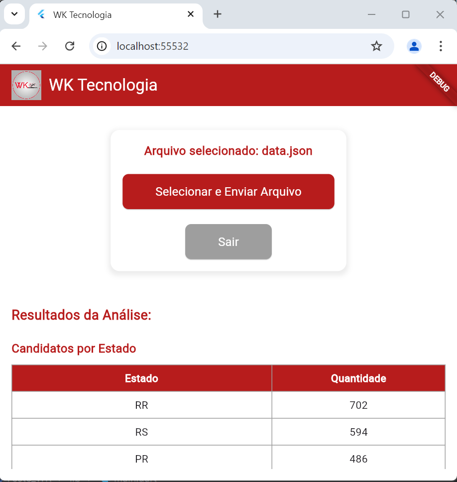

## Nome do Projeto 
TESTE_WK

## OBJETIVO DA APLICAÇÃO
Interface para upload do arquivo JSON que será processado pela API.

---

## ENVIRONMENT
```yaml
environment:
  sdk: ">=3.6.0 <4.0.0"
  flutter: ">=3.10.0"

dependencies:
  flutter:
    sdk: flutter
  http_parser: ^4.0.0
  http: ^1.2.2
  file_picker: ^4.6.1
  cupertino_icons: ^1.0.8

dev_dependencies:
  flutter_test:
    sdk: flutter
  flutter_lints: ^5.0.0

flutter:
  uses-material-design: true
  assets:
    - assets/logo.png
```

---

## COMO EXECUTAR O PROJETO

1. **Certifique-se de ter o Flutter instalado em sua máquina.**
    - Consulte as [Instruções de instalação do Flutter](https://chatgpt.com/c/67902ff3-f938-8008-b8de-ff713d10784b#:~:text=Instru%C3%A7%C3%A3o%C3%B5es%20de%20instala%C3%A7%C3%A3o%20do%20Flutter).

2. **Clone o repositório do projeto:**
   ```bash
   git clone <URL_DO_REPOSITORIO>
   cd teste_wk
   ```

3. **Instale as dependências do projeto:**
   ```bash
   flutter pub get
   ```

4. **Execute o aplicativo:**
   ```bash
   flutter run
   ```
---

## EXEMPLO DE INTERFACE
Após tudo instalado, a página deverá ser exibida conforme abaixo:




---

**Observação:** 
  Certifique-se de que todas as dependências estejam atualizadas para evitar problemas de compatibilidade.
---
